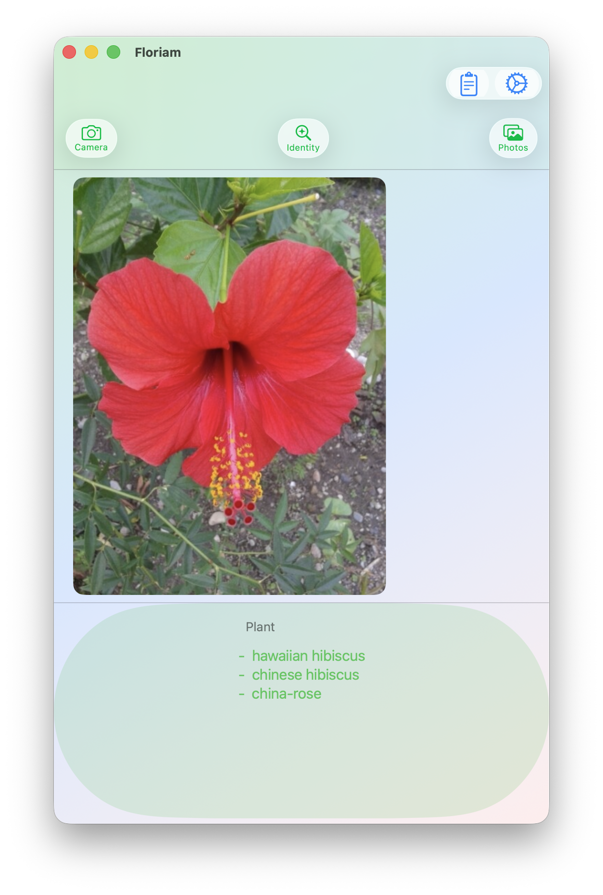

#  Floriam

A basic app to identify a plant from a picture taken with the camera or from the Photos App. The app uses [Pl@ntNet API](https://my.plantnet.org/doc/api/openapi) to identify the plant in the picture.

  

## Usage

First select the **gear icon** and add your **api-key** and save.

The **List** keeps only the last 10 identified pictures.

Multiple selections (up to 3) from the **Photos App** can used to identify **one** plant.  

When using the **Camera**, only the one picture is used to identify the plant.

### References

-   [Pl@ntNet](https://my.plantnet.org/)

-   [Pl@ntNet API](https://my.plantnet.org/doc/api/openapi)

### Requirements

-   require a valid **api-key** by creating an account, see [Pl@ntNet](https://my.plantnet.org/). A free account can be used.

